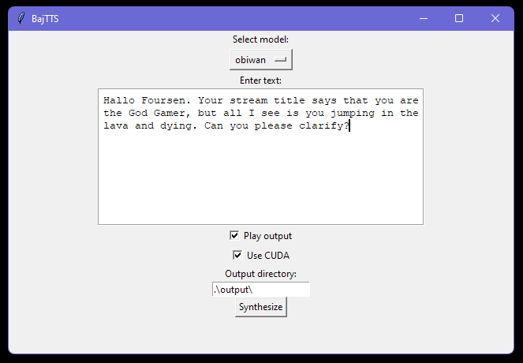

# BajTTS

Open source text to speech for Forsen Bajs.



## About

These are VITS models trained by finetuning the pretrained VITS LJSpeech model from Coqui TTS. The models are trained on various datasets which were denoised and then transcribed with OpenAI Whisper.

Compared to notaistreamer's implementation for Forsen, I believe he uses Tacotron + WaveRNN. I think the WaveRNN vocoder sounds nicer than what VITS ends up producing, but because VITS is E2E, the training is much less of a pain and can be done in a single stage for each voice.

This model is trained on phonemes instead of characters so you might need to play around with pronunciation (e.g. "foursen" instead of "forsen").

## Voice samples

- Forsen
- XQC
- Donald Trump
- Obi-Wan Kenobi (Alec Guinness)
- Juice WRLD
- David Attenborough

https://soundcloud.com/enlyth/sets/bajtts-samples

## Usage

Download the pretrained models from huggingface:

https://huggingface.co/enlyth/baj-tts/tree/main

Make sure the `models` directory is in the same directory as the `bajtts.py` file, and includes the `config.json`.

You can use conda if you want, the only requirements are coqui-tts and pygame.

```bash
pip install -r requirements.txt
python bajtts.py
```

CUDA is optional. How to setup CUDA correctly is out of scope for this readme.
